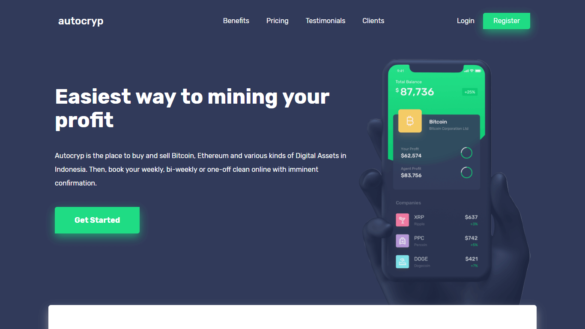
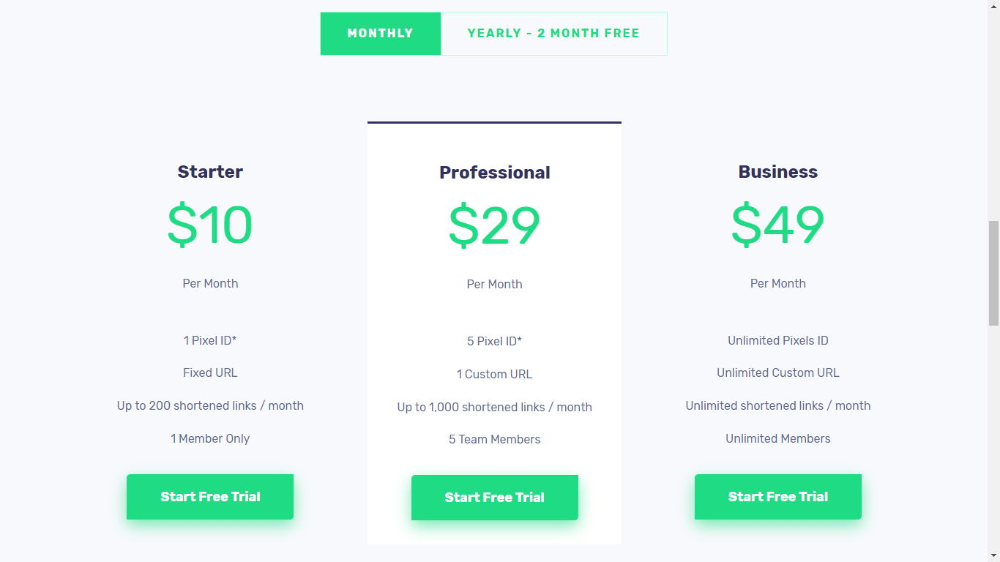
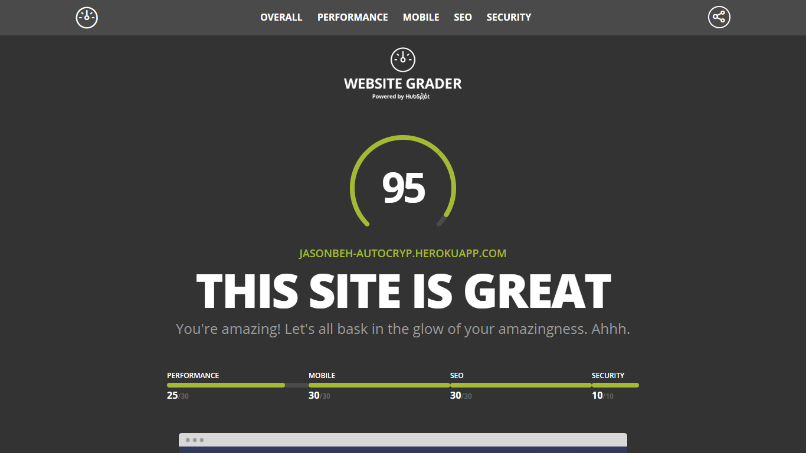

Autocryp is a fictional platform that allows users to buy and sell Bitcoin, Ethereum and various kinds of Digital Assets in Indonesia. It is deemed as an easy-to-use application that has absolutely the best security, by its founders. (Mock project)

## Technologies Used

HTML, CSS, JavaScript

## Project Date
29 Aug 2018 - 30 Aug 2018 ( 2 days )

###### Product Driven Hero Section

###### Pricing Cards Section

This website emphasizes on readibility, although it tends to lean more on a darker color scheme. Nonetheless, the whitespace is able to compensate by providing digestibility of content and vital details such as the pricing cards section.

Not to mention its uniquely designed testimonials section that garners the attention of web visitors, I think the website is perfectly designed in its own way.

###### High Website Score via Website Grader

Yay! A score of 95/100. I think I might need to fix with the render blocking resources to bump it to perfection.

---

## What I Learned

Autocryp was also a mock website to further test my front end workflow and efficiency. The reason why I chose this design by someone else was because of its nice UI and a rather more complex design. Nevertheless, I managed to complete it within 2 days with the help of flexbox and my past experience with the other 2 mock websites. For your information, this will be the last mock website that I will be deploying.