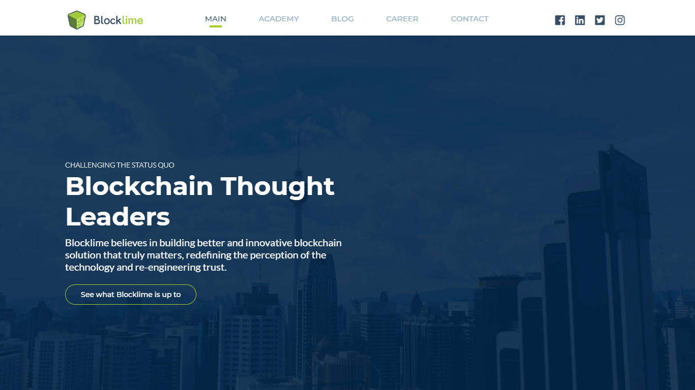
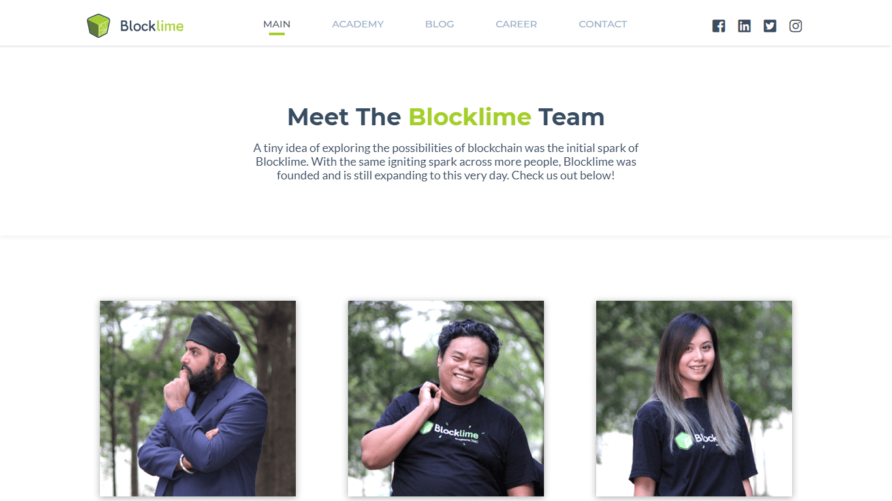
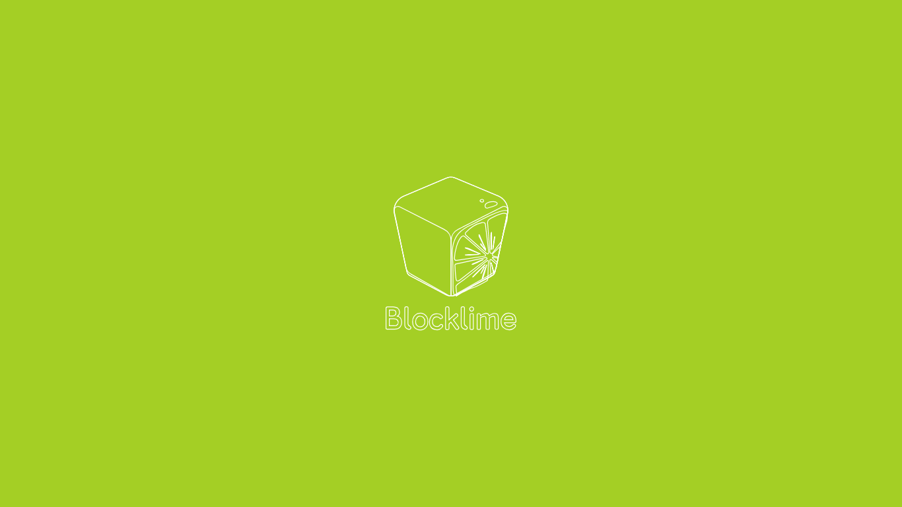
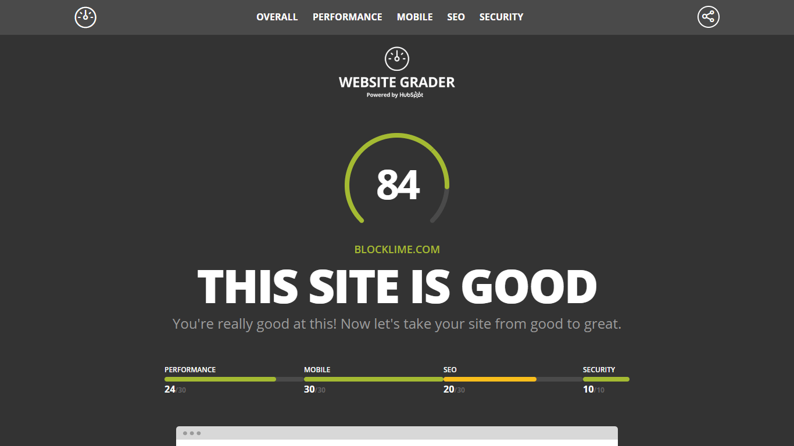

Blocklime Technologies Sdn Bhd is a Blockchain Technology and Distributed Ledger Technology solution specialist and provider. They aim to empower the public via education and technology, especially in the new emerging field of blockchain technology. As of 2018, they will have 1000 certified blockchain developers in the heart of Malaysia!

## Technologies Used

HTML, CSS, JavaScript, Node.js, AWS S3 & DynamoDB

## Project Date
July 2018 - Aug 2018 ( 1 month )

###### Clean UI

###### Amazing Team Page

###### SVG Loading Animation

Featuring a 10 page website that ultimately possess clean UI and tremendous whitespace, Blocklime website also has some front end animations up their sleeves. With the help of several beautiful illustrations made by their product designer, I developed multiple slide in SVG animations and a custom loading screen on first visit.

A custom CMS was also made to increase the dynamic aspect of the website, notably the career page, blog page and events section under academy page. Despite the number of content available, I managed to optimize the website to empower user-friendliness.

###### High Website Score via Website Grader

As you can see, we have an awesome score of 84/100. The part that is lacking in the SEO is mainly the absence of sitemap, which the Blocklime team needs to manage before bumping the score to a solid 94/100.

---

## What I Learned

Before Blocklime website, I mainly designed and developed websites on my own. This time however, I worked with an awesome product designer that was highly collaborative and energetic. Our fusion of spontaneous workflow eventually led to the birth of this great website. Overall, the process of building this website increased my collaboration and teamwork skills, and it was fun!