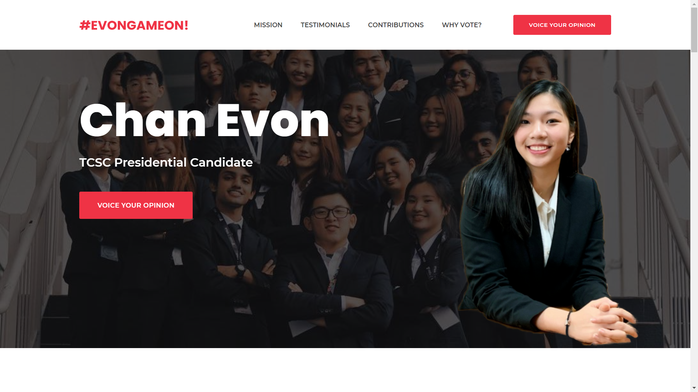
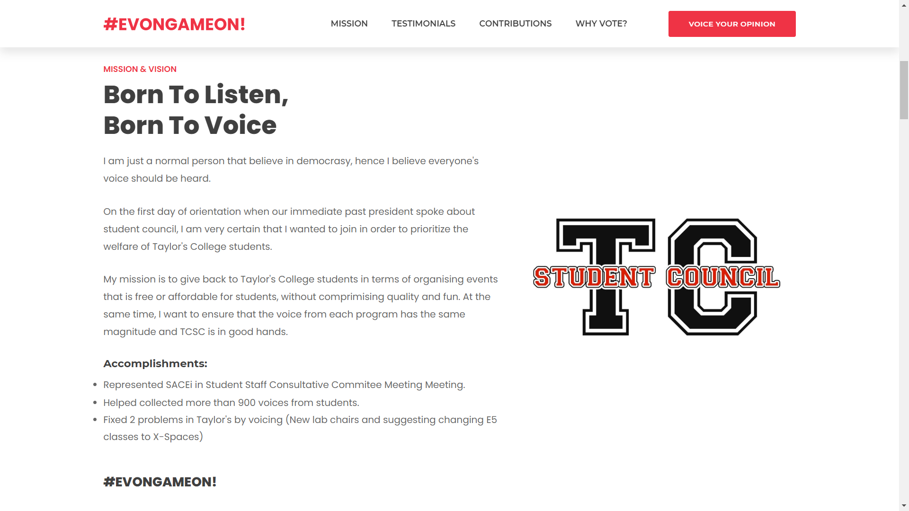
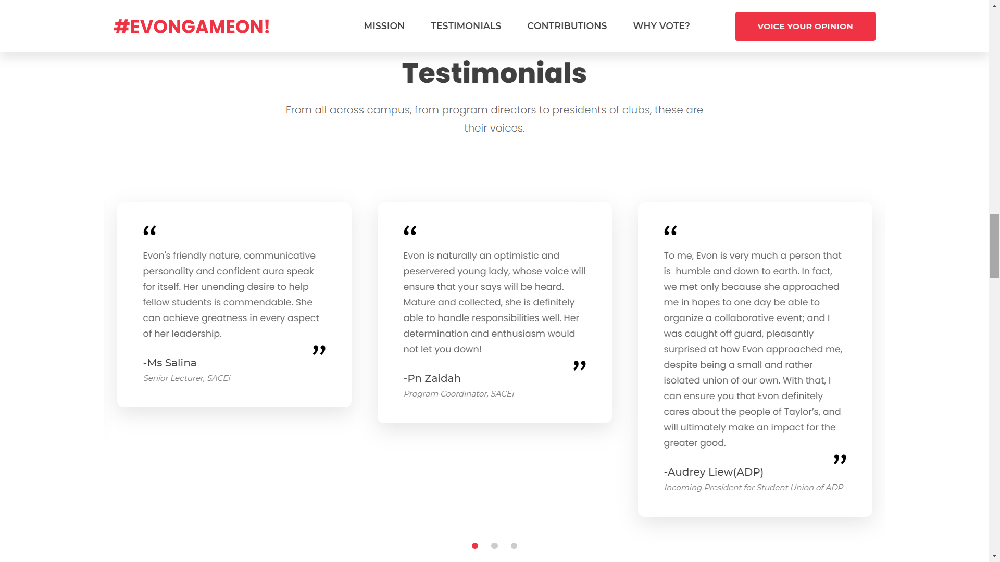
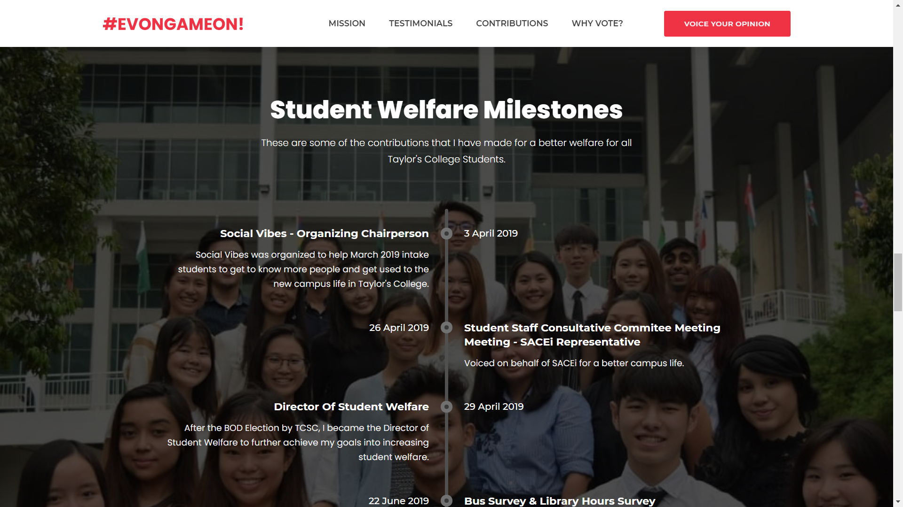

This presidential campaign website was built to market Chan Evon, the president candidate for Taylor's College Student Council 2019/2020. It provides an easy-to-access platform for Taylor's College students to better understand her as an individual and a potential president for Taylor's College Student Council.

## Technologies Used

HTML, CSS, JavaScript

## Project Date

8 August 2019

###### Hero Section

###### Mission & Vision

Big typography and the strong red color were utilized to gain the user's attention, when they visit the website. At that time, I tried to develop the website as quickly as possible, because the quicker the deployment of website, the more time Chan Evon has to gather the interest of her voters.

The design was also made in a way such that the message is clear and concise, without much long witted elaborations that may drive users away. Many subtle animations were also used to keep the user's attention on the website to explore more and know more about her.

###### Key Testimonials Section

###### Chronological Milestones

The testimonials section consist of many good feedback from different people, such as other club presidents, college students, teachers and even a programme director. With the layout of her accomplishment in Taylor's College Student Council, I also managed to make a timeline to showcase her milestones since she was in Taylor's College Student Council.

---

## What I Learned

I have learned more about collaboration and meeting a client's needs based on their requirements. I also had a lot of fun developing it and tracking the users via Google Analytics after marketing the website. Although the website will not be a permanent one to stay, but it was a fulfilling project for me to develop and witness its use case.
