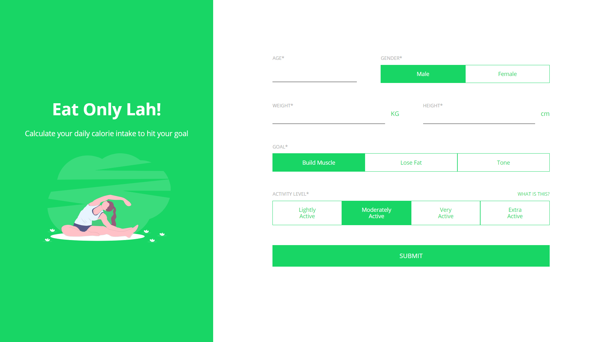
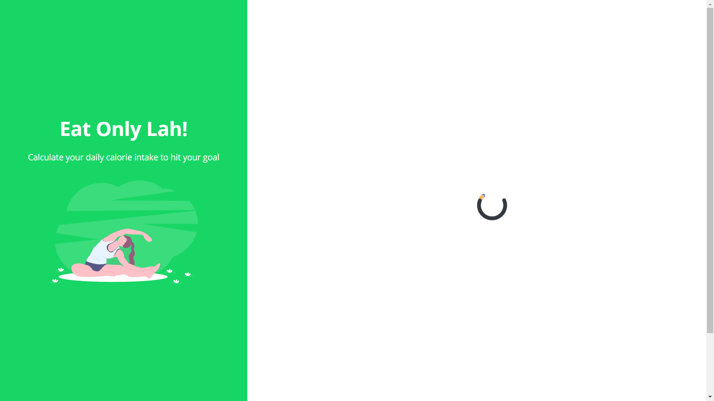
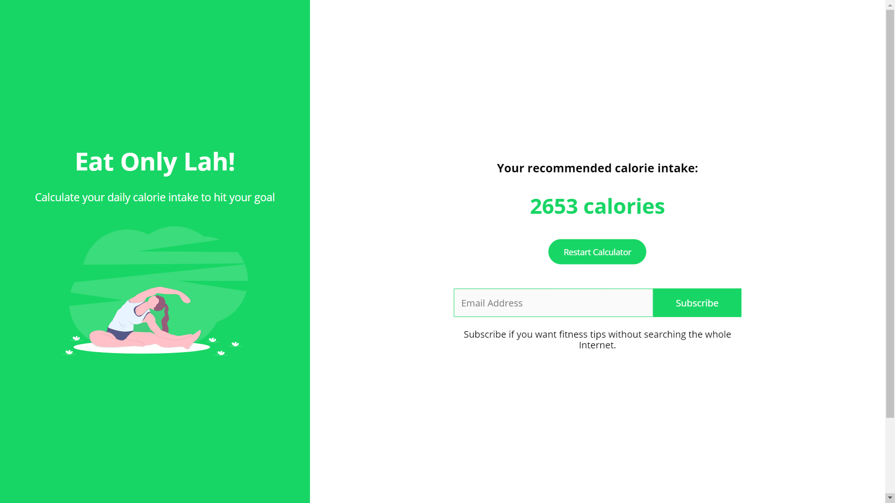

EatOnlyLah is an experimental project that helps people get their recommended calorie intake based on their biometrics.

## Technologies Used

HTML, CSS, JavaScript

## Project Date

22 November 2018

###### First Look of EatOnlyLah

###### Loading Animation

###### Final Output

Knowing your daily calorie intake so that you can achieve your personal fitness goal is essential. Inspired by other website that have a calorie intake calculator, I have decided to build one myself with a friend.

Together, the project was done after numerous changes of UI design. In the end, we chose a apple green color to make the mini application stand out. After the usage of the calculator, the user can also add their email in to subscribe to our email list.

The website is also responsive for all devices so that any user can use it.

---

## What I Learned

It was a great experience to spin off a simple application like this. Although it is not a profit making or an attention grabbing product, but a fun project like EatOnlyLah is worthwhile to build.
