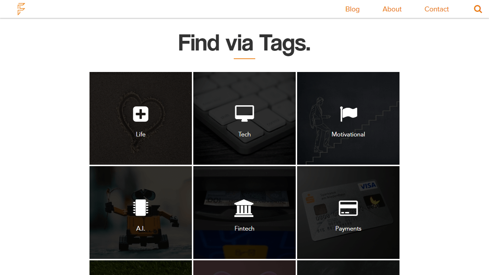
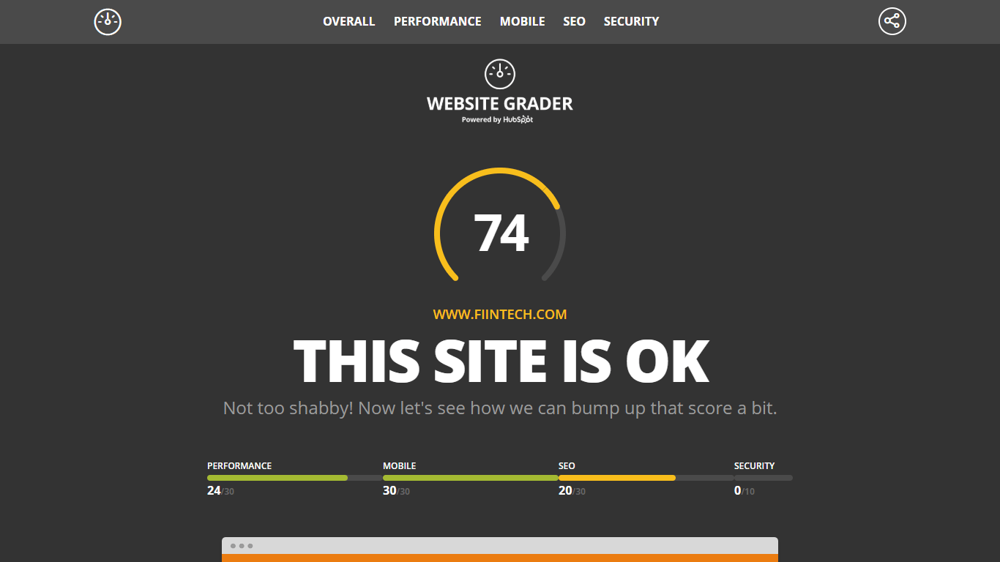

Fiintech provides updated insights about the fintech industry in Malaysia. Their mission is to provide the uplift of the fintech industry, by specifically empowering users with powerful articles and opinions about current fintech trends.

## Technologies Used

HTML, CSS, JavaScript, Node.js, MongoDB

## Project Date
March 2017 - Dec 2017 ( 10 months )

###### Spotify Inspired UI

###### Blog Page

Upon visiting this website, a custom made loading screen followed by a cool carousel will welcome you. Popup for a newsletter will also slide down to prompt user to subscribe to their email list.

The blog of Fiintech is operated by a custom CMS that is authenticated via a login system. Data are then stored in a MongoDB NoSQL database for dynamic creation of blog posts. Tags and authors are also made using the custom CMS.

###### High Website Score via Website Grader

As you can see, we have a score of 74/100. The website needs some optimization in terms of loading speed and a SSL certificate to make it operate in HTTPS. Otherwise, I believe the score will be higher for sure.

---

## What I Learned

Fiintech website was indeed my first Node.js application that is considered as a shippable product. I have learned many skills in both technical and project management, which are extremely valuable, along the journey of building this website. The fun and challenges that came with this website was mind blowing to me, especially to a 15 year old teenager.