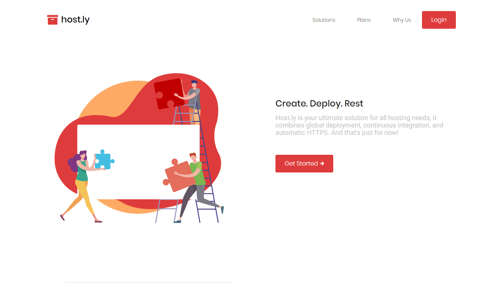
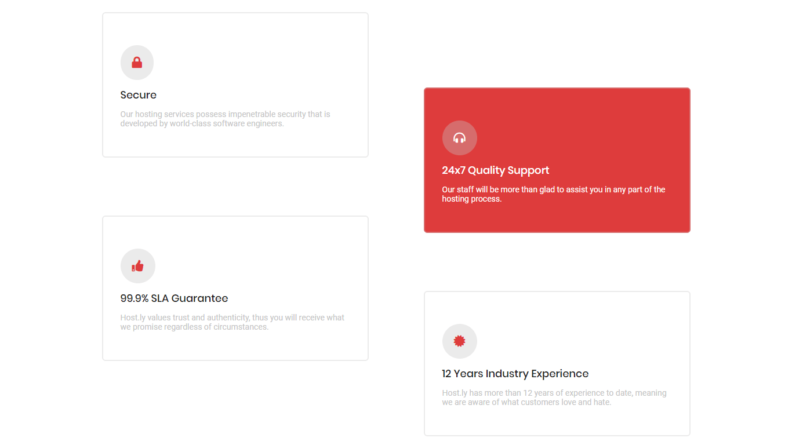
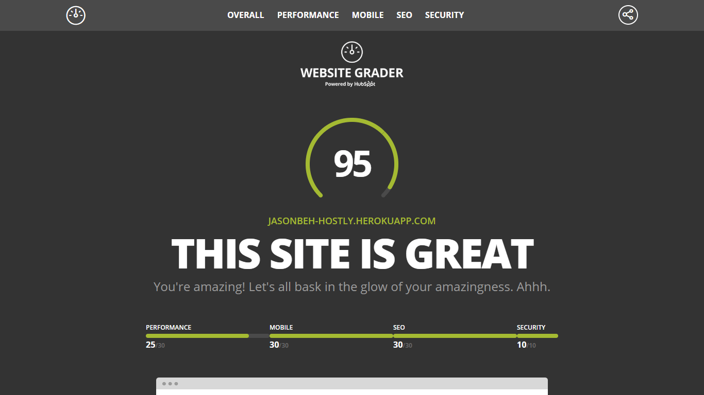

Host.ly is a fictional platform that settles all your hosting needs and problems by providing good customer service and diversified plans that suit everyone. (Mock Project)

## Technologies Used

HTML, CSS, JavaScript

## Project Date
27 Aug 2018 ( 1 day )

###### Whitespace Driven UI

###### Features Section

One thing that is focused in this website is whitespace. Upon visiting the website, you will acknowledge the power of whitespace in making everything more appealing and convinient to the eyes.

The creative testimonials section is used to cultivate trust and authenticity, as user feedbacks are given back after the usage of Host.ly products.

###### High Website Score via Website Grader

A magnificent score of 95/100! It needs a tiny vit of improvement in render blocking resources. Or else, I think it might reach a 100/100!

---

## What I Learned

Host.ly was a mock website that was designed by someone else. The sole purpose of me to make this website is to test my speed in web development and to rely more on flexbox rather than Bootstrap column grids. Now, I love flexbox and I thankfully managed to deploy this one page website in 1 day only! It was indeed a HUGE milestone of improvement in terms of speed.