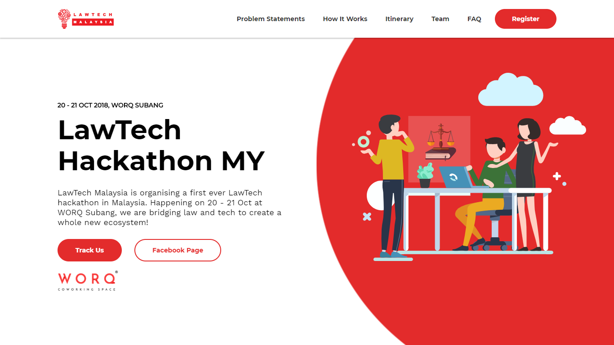
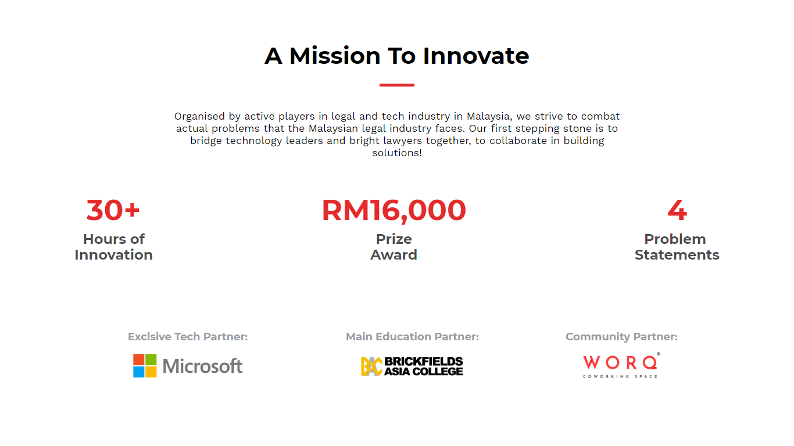
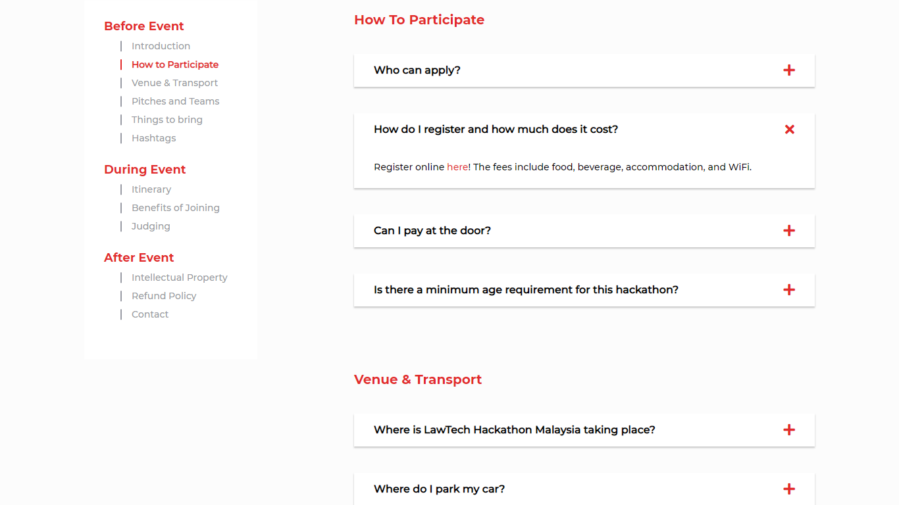
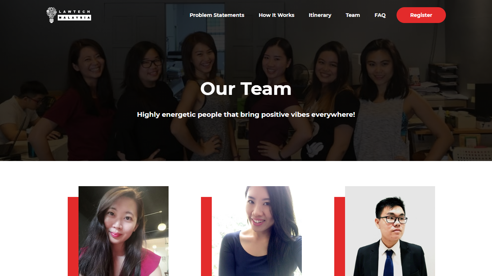
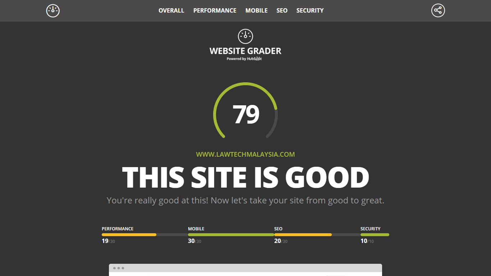

This website was LawTech Malaysia Hackathon 2018's main hackathon website. Driving traffic and providing information were the main priorities of the website, as it was part of the user journey for the participants. Hence, a clean yet effective design was chosen.

## Technologies Used

HTML, CSS, JavaScript, AWS S3

## Project Date
20 September 2018 - 24 September 2018 ( 4 days )

###### Hero Section

###### Mission Section

Although the hero was similar to my jasonbeh.com(v2), but I believe it serves as a way to capture people's attention. The call to actions were also prety straightforward for users.

On the right, we stated our mission and the prize awards after the hero to increase interest and keep users excited. Sponsors and partners were also provided to ensure authenticity and trust.

###### FAQ

###### Our Team!

Many questions were asked pre-event and on pre-hack itself, which was why an interactive yet detailed FAQ was made to compensate the common curiosities that users have.

We also rocked a team page to provide some bloopers about the core diverse team behind. (Have a look, perhaps some of them are your friends!)

###### High Website Score via Website Grader

It only got a 79/100, because I didn't have time to fully optimize it, as there was a need to juggle between feature development and optimization.

---

## What I Learned

I learned some insights about copywriting, especially since most people that I have worked with to make this website are lawyers. Delivering the right message with the right choice of words without being vague is important. Apart from that, the hackathon was a huge blast with the energy and the vibe that the event had!