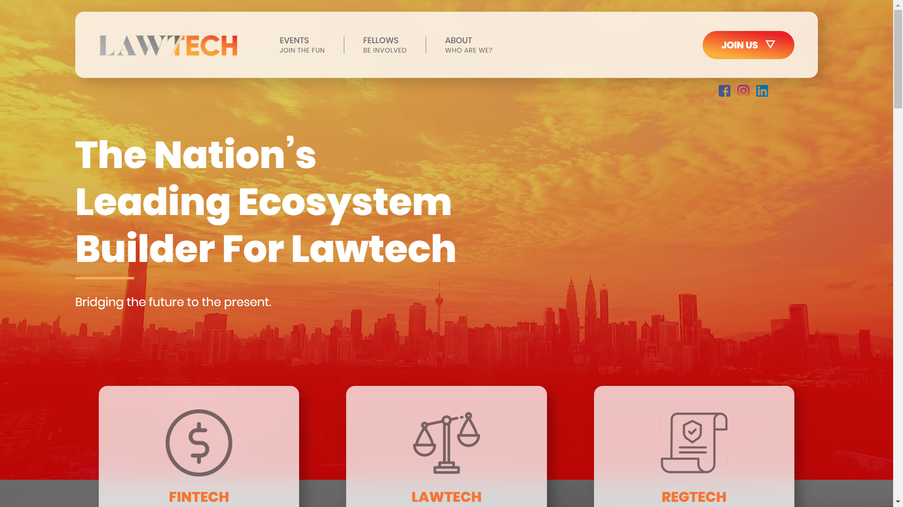
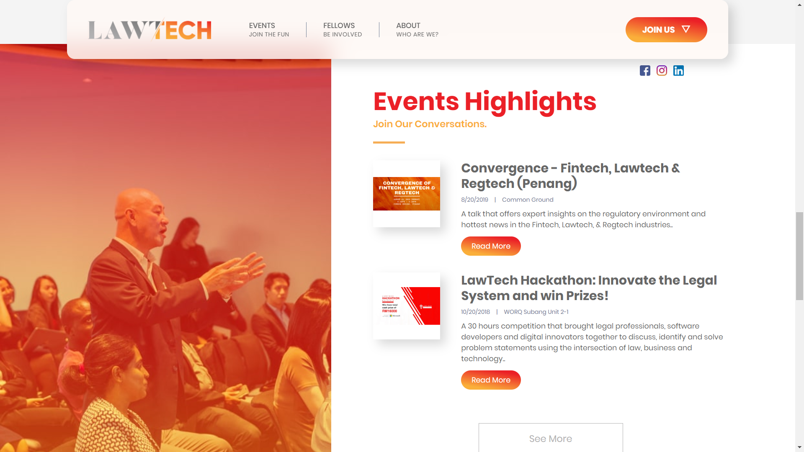
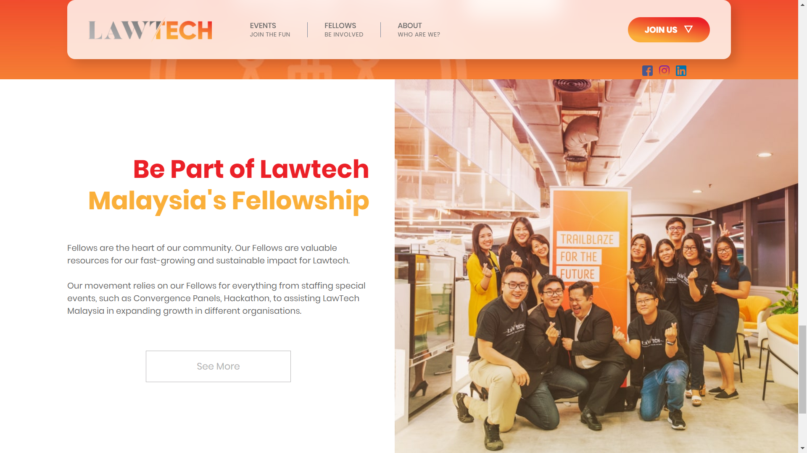

LawTech Malaysia is a corporate entity that aims to promote effective and long term digital transformation in the legal industry in Malaysia and ASEAN.

## Technologies Used

HTML, CSS, JavaScript, React, CMS, Node.js

## Project Date

22 Febuary 2020

###### Hero Section

###### Event List

With a bright yellow red gradient and huge typography design, Lawtech Malaysia plans to lead in building Malaysia's lawtech ecosystem.

Lawtech Malaysia is active in providing events to help drive the community to strive for lawtech innovation. Keeping track of these events via the website will let users know more about them, including future events that they can participate as well.

###### Be a part of Lawtech Malaysia!

If you have ever thought of joining LawtechMalaysia as a contributor/fellow, you can always signup with a form and I am sure they will get back to you as soon as possible. In my opinion, it was a very fun yet fruitful experience in Lawtech Malaysia thus far.

---

## What I Learned

I learned that communication is very important, especially between the designer, developer and copywriter. There were many times where we iterate again, because we wanted to change something. In the end, a lot of time and effort were wasted, and there were too many uncertainties in between. However, I am proud that the website is complete and usable for everyone!
