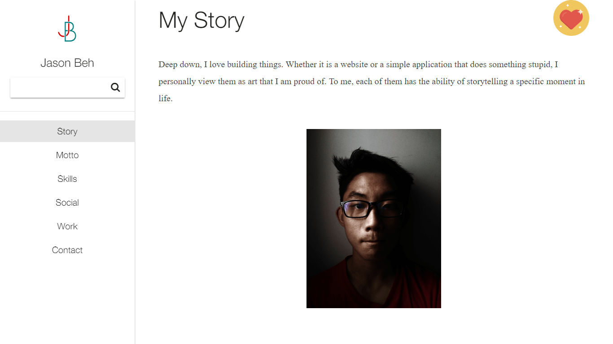

This is the first version of my portfolio website when I just started to learn basic web development. It is hideous, but it is worth keeping to know where I have come from.

## Technologies Used

HTML, CSS, JavaScript

## Project Date
January 2017 - February 2017 ( 2 months )

###### Simple Hero Page

###### About Me

Back then, I made a one page website for my personal portfolio. I didn't had much experience back then, hence I tried my very best to make it as aesthetic as possible. I was a huge fan of brush fonts when I was developing it, hence the choice of fonts!

I am not very proud of my design back then, but I am happy that I tried to make it as clean as possible and not too complicated for anyone to view. Nonetheless, I think it was a great start for an aspiring web developer that was self taught.

---

## What I Learned

After building this website, I felt happy, because it was the first ever product/prototype that I have made! I knew back then that although I have completed it, the journey ahead will not be easy. Overall, my passion for tech increases.