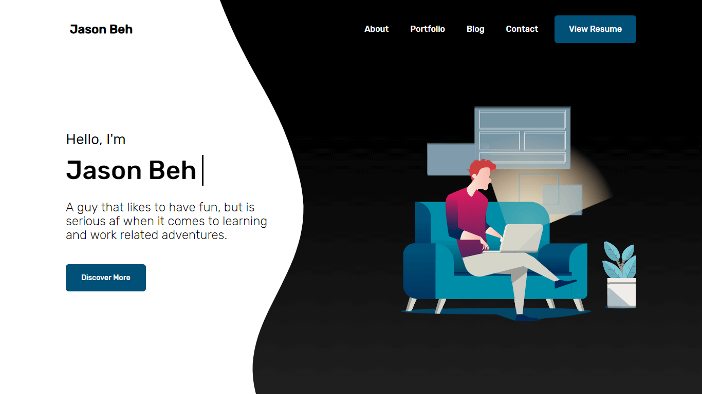
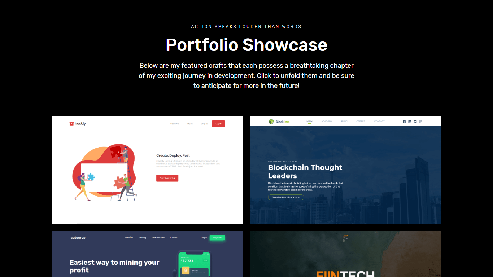

This is the second version of my portfolio website when I just started to learn basic web development. In this version, I have improved a lot in terms of UI, design, web optimization and content as well.

## Technologies Used

HTML, CSS, JavaScript, Node.js, Gulp

## Project Date

04 September 2018 - 06 September 2018 ( 2 days )

###### Sleek Hero Page

###### Portfolio Showcase

I absolutely love this new version that I have designed and made back then. It was a portfolio website that I was very proud of, because it was the best representation that I wanted to portray myself.

With the cleaner and more aesthetic design, I felt more pleased to view the website. The information and content were also much more well structed compared to v1, which is ideal for anyone to read and learn more about me.

With gulp and web optimization strategies, I have managed to deal with high load resources bottleneck issues and minify all the files to ensure that the website runs smoothly for all users.

---

## What I Learned

Upon completion of Personal Website v2, I have learned a lot in terms of optimizing content and creating beautiful UIs. It was not easy at the begining, but after countless of help seeked from StackOverflow and Google, I managed to complete this project successfully.
