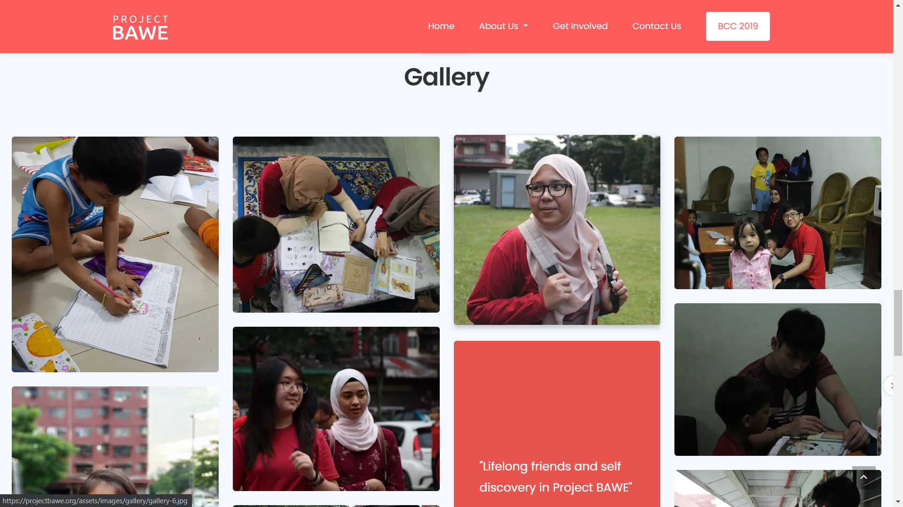

Project BAWE is a project that aims to close Malaysia education inequality gap by providing free personalized home tuition to underprivileged children living in poverty, all led by youths.

## Technologies Used

HTML, CSS, JavaScript

## Project Date

9 September 2019

###### Hero Section

###### Key Statistics

The hero section strives to inform the user about the problem that Project BAWE is trying to solve, in the most effective way possible.

With the help of the statistics that we have done, it demonstrates the impact that Project BAWE has provide to the community.

###### Apply To Be A Volunteer

###### Gallery

People often ask us on how to contribute to help the children that are in need. With a clear distinction of the different type of contributions we provide, people can get a better understanding and get started right away by clicking into more details!

Our gallery aims to show people how joyful and rewarding can volunteering to teach children be. Be sure to check out the gallery to see what the youths do to help the children.

###### Media & Press

Project BAWE has a widespread impact in the community since its early stages. Many media outlets and sponsors have taken the lead to help spread the awareness of this project and how an individual can contribute to help.

---

## What I Learned

I have gained the experience of building a website for a social purpose, as well as collaborating more with the founder to ensure that the website goals meet with Project BAWE's goal. Also, I didn't imagine the possibility that coding for social purpose can be a form of contribution to Project BAWE and to the society too!
