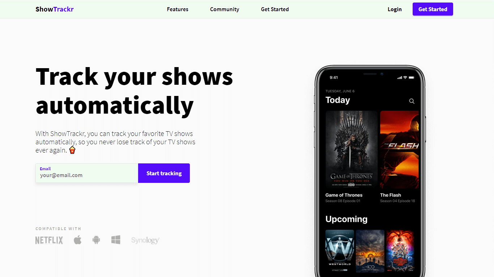
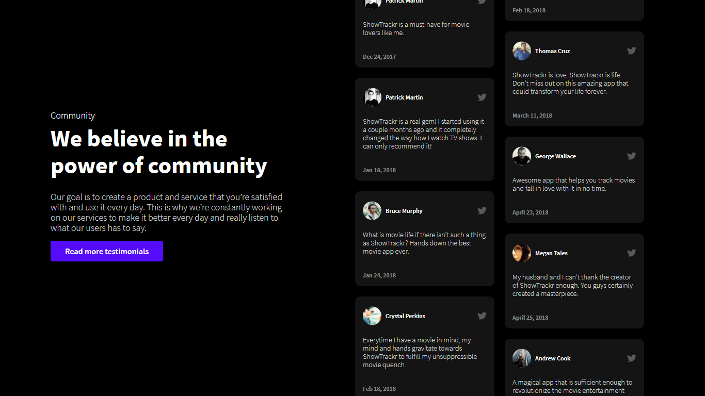
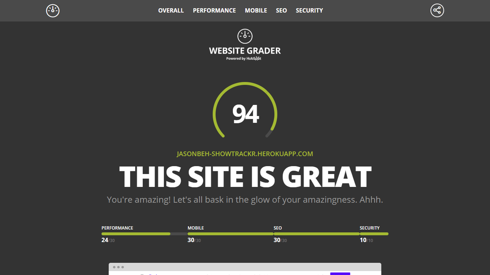

ShowTrackr is a fictional app that allows you to keep track of your favourite TV shows and movies, so that you will never miss out on any movies again. Not to mention spoilers from your friends, because you will be prompted to watch it first! (Mock project)

## Technologies Used

HTML, CSS, JavaScript

## Project Date

24 Aug 2018 - 26 Aug 2018 ( 3 days )

###### Product Driven Hero Section

###### Pricing Cards Section

There are many images that are related to the app or tv shows to portray the consistency of the website design. Clear headings and call to actions are also available to increase user interaction and usability.

Although the website is simple, but the UI is overall clean and visually appealing to the general audience of users.

###### High Website Score via Website Grader

Woohoo! A score of 94/100 is definitely excellent. If I am not mistaken, the website just need a minor improvement in reducing render blocking resources.

---

## What I Learned

ShowTrackr was a mock website that I made to test my proficiency in quick web development, and to add to my portfolio of what I can do. Design is originally made by someone else called Daniel Korpai, which I am extremely grateful for. ShowTrackr was also a way to test my own front end workflow and efficiency.
