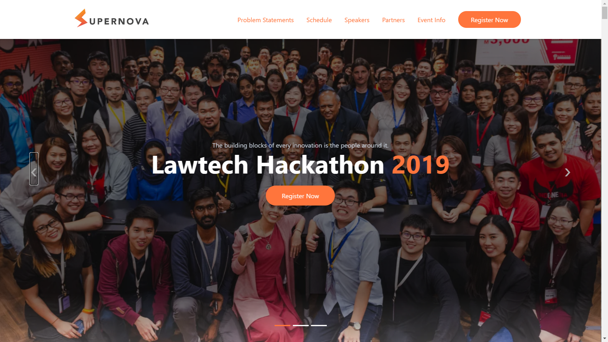
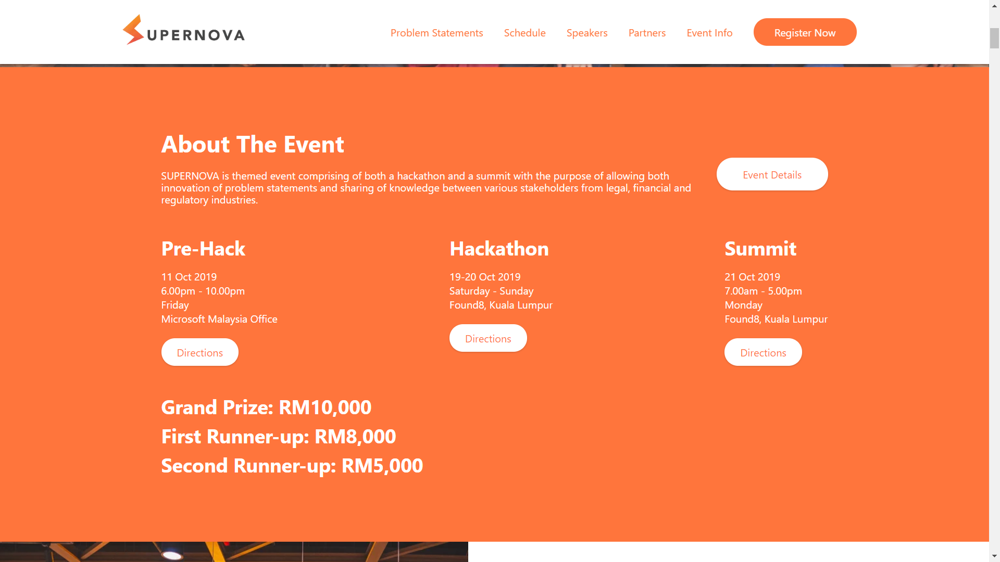
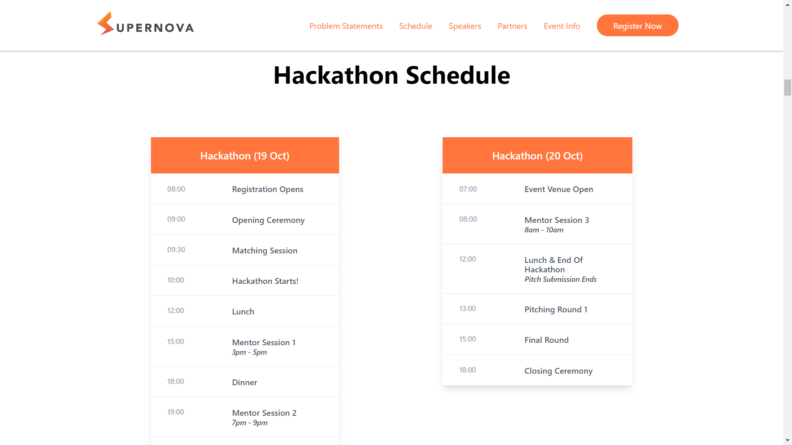
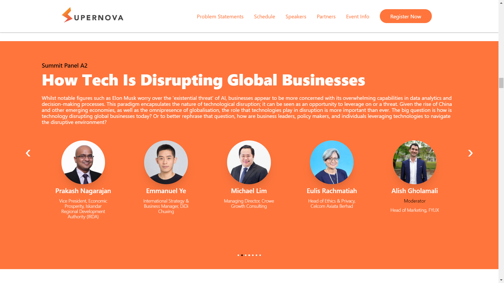
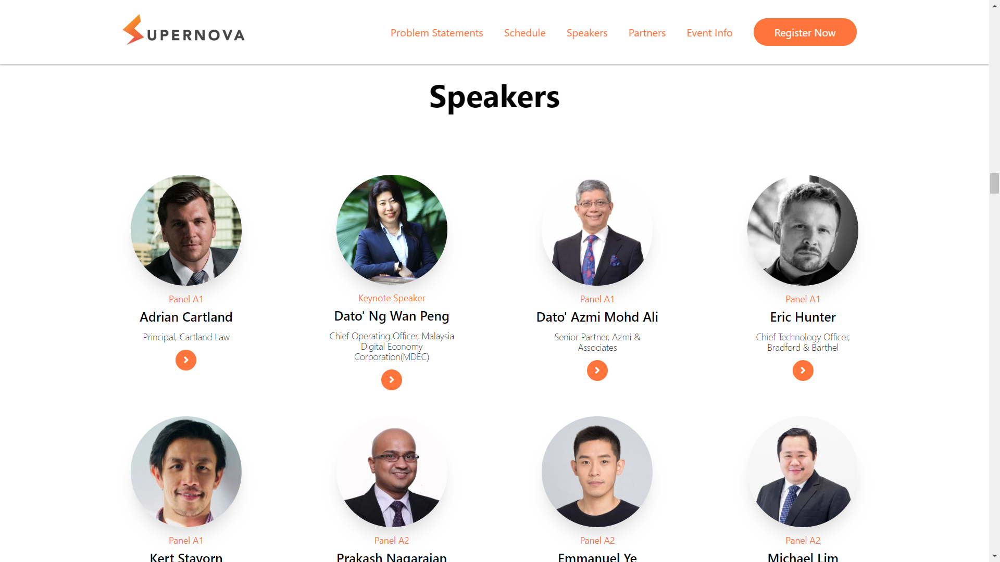
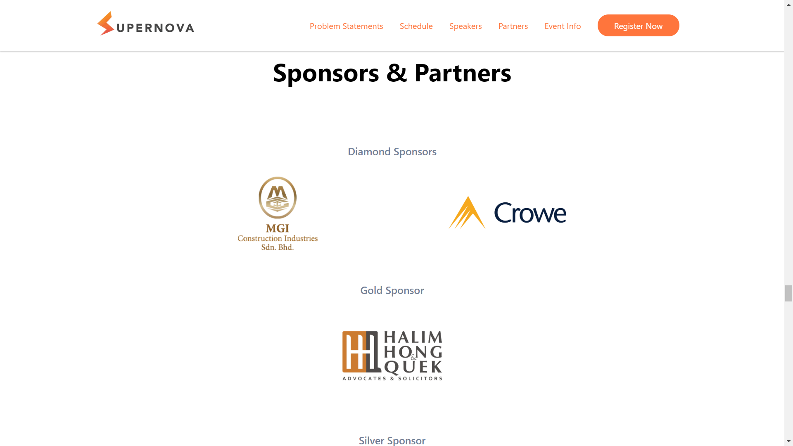

SUPERNOVA is themed event comprising of both a hackathon and a summit with the purpose of allowing both innovation of problem statements and sharing of knowledge between various stakeholders from legal, financial and regulatory industries.

## Technologies Used

HTML, CSS, JavaScript, Gulp

## Project Date

26 September 2019

###### Hero Slider

###### Event Details

The hero carousel feature is meant to display nice photos to capture the user's attention. If you slide to the right, you will discover that this hackathon is also a mixer party with young lawyers, and an event to soft launch with partners!

Our concentrated event details sections offers the visitor all important details that they need to know if they were given a 1 minute pitch of the basics of the event.

###### Schedule UI

###### Panel Discussion Showcase

Supernova Summit is not only a hackathon. As you can see from the schedule, we had a lot of chronological speaking events as well. Having a schedule to inform the participants was extremely vital to keep things organized.

We had 7 different panel discussions that had topics such as Big Law vs New Law, Cybersecurity & Law Protection and more. Clear distinction of each topic and the respective speakers is needed for participants to know what they are interested in.

###### Speaker's Profile

###### Sponsors & Partners

With over 70+ industry leaders from different dynamics, that were involved in judging, mentoring or speaking, we made sure that participants can also network and hopefully gain some advice in terms of the feasibility of their MVP. Who knows, an investor may also be there to invest in your initial stage of a new startup!

---

## What I Learned

I learned that optimization for event website is extremely important, because participants will often be visiting them regularly before and during the event. Perhaps I should have developed a PWA like Google I/O Extended by GDGKL, but I remember vividly that I haven't experimented PWA enough yet to use it in real world applications.
