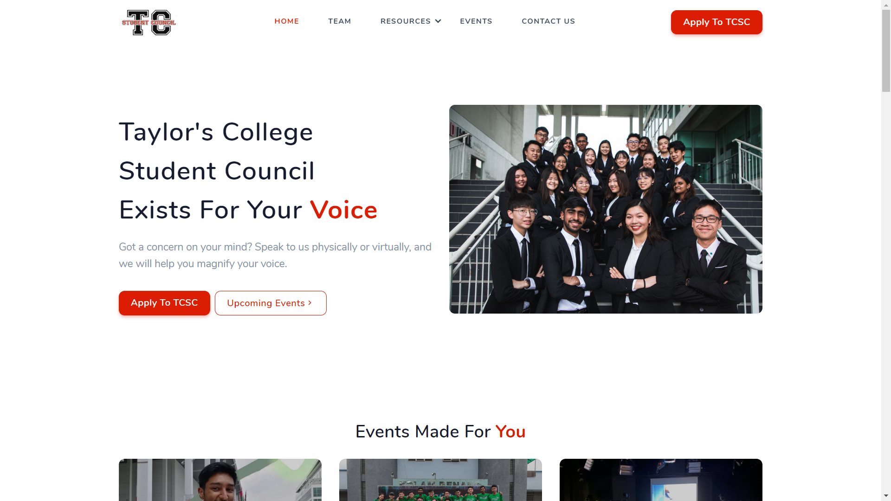
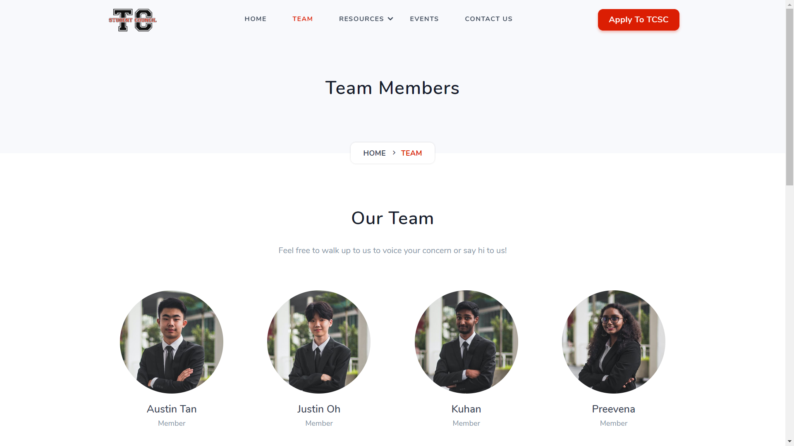
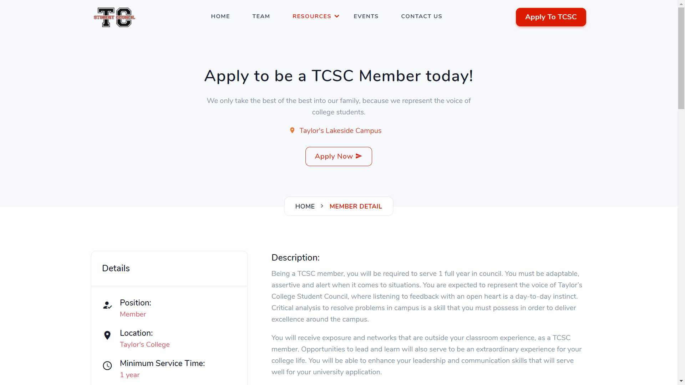
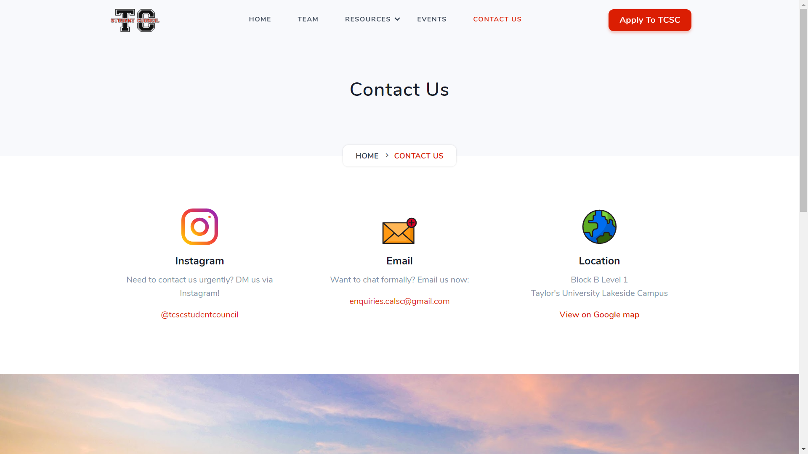

Taylor's College Student Council needed a platform for the ease of displaying static information, with little change to some data only. We needed a way to show Taylor's College Students what we have done and a way to contact us easily.

## Technologies Used

HTML, CSS, JavaScript, React, Headless CMS

## Project Date

12 January 2020

###### Hero Section

###### Mission & Vision

With a strong focus on professionalism, Taylor's College Student Council strive to deliver excellent quality service/events to students. Hence, we emphasized a lot in crispy photos, because we are ready to assist them whenever they are in need.

We also have a page for our members, where students can recognize them and ultimately make Taylor's College Student Council more approachable as a student union. Our formal photos once again, is to maintain professionalism and formality in serving our students that are in need.

###### Apply To Be Member Page

###### Contact Us Page

We noticed that there are aspiring and capable students that wish to join Taylor's College Student Council, but the problem lies in our lack of transparency in communicating with students the procedure of becoming a member. Details such as how long is the serving time, types of departments available, EXCO and BODs positions, and more, are often the questions that are among the hearts of students. Therefore, with a proper website page to view all details and a link to direct them to become a member will solve this problem for sure!

On top of that, the contact page gives students another way to contact us.

I also noticed a problem of sustainability in such websites. With the next term of Taylor's College Student Council, they might not know how to code to change certain minor details. The solution: a headless CMS that offers limited customizability to key sections such as our team, events and more.

If you are wondering why I prefer to choose headless CMS + React code, rather than just wordpress, the short answer is cost. Perhaps I will cover more in detail in a upcoming article to share my thoughts.

---

## What I Learned

I have understand more about building a product that has both sustainability and practicality. As developers, we cannot always assume that non-techies can pick up tech stuff, just by telling them that everyone can learn to code. Instead, we should empower them with solutions that can help bridge the world and achieve a better solution overall. Besides that, I learned that good photos can make a website much more appealing!
